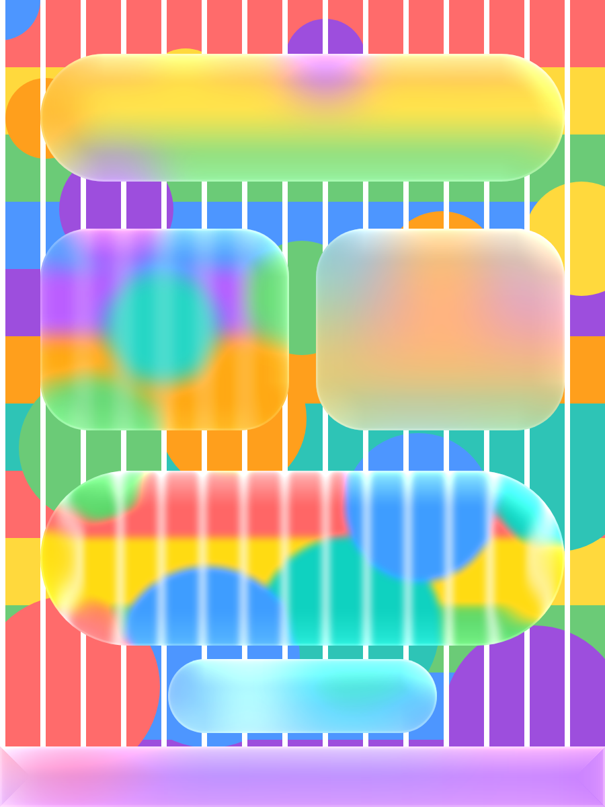

# react-native-liquid-glass

Liquid Glass surfaces for React Native: real, live background blur with edge refraction, rim lighting and touch response.

- **Android is first-class.** GPU blur and an AGSL refraction shader on Android 13+, GPU blur on Android 12, and an automatic snapshot fallback on Android 7–11.
- **iOS uses the system.** iOS 26+ gets Apple's own `UIGlassEffect`; iOS 15–25 gets native materials.
- **One API everywhere.** You write `<LiquidGlassView>` and the library picks the best renderer for each device.

```tsx
import { GlassBackdrop, LiquidGlassView } from '@sachin-meena/react-native-liquid-glass';

<View style={{ flex: 1 }}>
  <GlassBackdrop style={StyleSheet.absoluteFill}>
    <ScrollView>{/* photos, lists, gradients… */}</ScrollView>
  </GlassBackdrop>

  <LiquidGlassView material="regular" style={{ position: 'absolute', top: 60, left: 16, right: 16, padding: 16 }}>
    <Text>Hello, glass</Text>
  </LiquidGlassView>
</View>
```



*Rendered by the library's own shader pipeline through Skia (`npm run preview:shader`): regular, thin, thick, clear (refraction + RGB split) and a pressed pill with touch light.*

## Install

```sh
npm install @sachin-meena/react-native-liquid-glass
cd ios && pod install
```

Then rebuild the app. It works in any app on the New Architecture (the default since RN 0.76), including Expo dev builds. **Expo Go is not supported**; there it falls back to a plain view instead of crashing.

## The one rule

> Put what the glass should blur inside a **`<GlassBackdrop>`**. Render the glass **next to it, on top**, never inside it.

```
<View>                       ← screen
 ├─ <GlassBackdrop>          ← background layer: images, lists, video
 │    └─ …content…
 └─ <LiquidGlassView>        ← glass layer: headers, buttons, cards, tab bars
```

iOS doesn't need the backdrop, but keeping it makes the same code work on both platforms.

## What you get on each device

| Device | Renderer | Blur | Refraction | Rim light | Touch light / squish |
|---|---|---|---|---|---|
| Android 13+ | `shader` | ✅ live, GPU | ✅ | ✅ shader | ✅ |
| Android 12 | `blur` | ✅ live, GPU | — | ✅ approximated | ✅ |
| Android 7–11 | `compat` | ✅ snapshot, throttled | — | ✅ approximated | ✅ |
| iOS 26+ | `system-glass` | ✅ system | ✅ system | ✅ system | ✅ system |
| iOS 15–25 | `system-material` | ✅ system | — | ✅ approximated | JS scale |
| Expo Go / web / tests | `fallback` | web: CSS `backdrop-filter` | — | — | — |

## Components

| Component | Use it for |
|---|---|
| `LiquidGlassView` | Any glass surface. Everything else is built from it. |
| `GlassBackdrop` | Wraps the content that glass should see through. |
| `LiquidGlassButton` | Pill button with press feedback. |
| `LiquidGlassCard` | Padded glass container. |
| `GlassThemeProvider` | App-wide defaults (material, quality, radius, overrides). |

## Documentation

| For | Read |
|---|---|
| App developers | [User guide](docs/user-guide/README.md): install, concepts, every prop, recipes, troubleshooting |
| Contributors and AI agents | [AGENTS.md](AGENTS.md) and [architecture docs](docs/architecture/README.md) |
| Every edge case and how it's handled | [docs/architecture/05-edge-cases.md](docs/architecture/05-edge-cases.md) |

## License

MIT
